<div align="center">

# 🛡️ GERARD VINCE LILLO
### Offensive Security | Security Automation | Cloud & Detection Engineering


</div>

```bash
$ initializing gerard.engine
> mode: hybrid_security
> cloud_detection: active
> automation_pipeline: operational
> offensive_context: enabled
```

---

# Overview

Security engineer with hands-on experience across detection operations, cloud security engineering, offensive validation, and automation development.

Focus areas:
- Detection quality improvement
- Automated defensive workflows
- Cloud-integrated security controls
- Operational efficiency through tooling

---

# Cloud Security Engineering

## Trend Micro File Storage Security (FSS) – AWS Implementation

**Architecture Components**
- AWS CloudFormation deployment
- Amazon S3 event-driven scanning workflow
- Dedicated clean bucket
- Dedicated quarantine bucket

**Workflow Design**
1. Object uploaded to monitored S3 bucket  
2. FSS scan triggered automatically  
3. Clean objects routed to clean bucket  
4. Malicious objects routed to quarantine bucket  

Objective: Automated malware validation with enforced storage segregation.

---

# Detection & XDR Operations

## Trend Micro Vision One (XDR)

**Operational Responsibilities**
- Endpoint threat investigation
- Telemetry correlation
- Root cause validation
- Containment workflow coordination
- Detection tuning and false-positive reduction

Environment: SOC-based monitoring and escalation workflows.

---

# Offensive Security & Validation

**Tooling & Techniques**
- Network reconnaissance (Nmap)
- Exploitation validation (Metasploit)
- Web application testing (OWASP ZAP)
- Windows system misconfiguration assessment

Purpose: Offensive methodology to validate defensive posture.

---

# Security Automation Engineering

**Languages**
- Python

**Automation Areas**
- Alert parsing and structured reporting
- Vulnerability result processing
- CI/CD security integration
- Workflow scripting for operational efficiency

---

# Technical Stack

Cloud:
- AWS (IAM, S3, EC2, VPC, Lambda, CloudFormation)

Security Platforms:
- Trend Micro Vision One
- Trend Micro FSS
- CrowdStrike
- Splunk
- Wazuh

Systems:
- Linux CLI
- Git

---

# Featured Engineering Projects

## GuardSweep
Python-based security automation and monitoring toolkit.

## Windows Vulnerability Scanner
Automated Windows misconfiguration auditing and structured reporting.

---

# 🎮 Polygon Swarm – Profile Vignette

```text
[ POLYGON SWARM // DEFENSE SIMULATION ]
core      : ONLINE
telemetry : STREAMING
rules     : ENFORCED
pipeline  : AUTOMATED

entities  : ● ● ● ● ● ● ● ● ● ●
behavior  : SWARM -> CONTAIN -> QUARANTINE
status    : HOLDING LINE
```



---

# Contact

Website: https://gerardvincelillo.com  
LinkedIn: https://www.linkedin.com/in/gerard-vince-lillo/