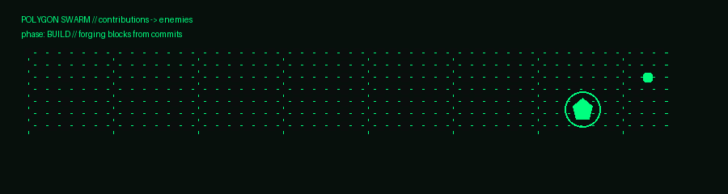

# 🛡️ GERARD VINCE LILLO  
### Offensive Security | Security Automation | Cloud & Detection Engineering

## Focus
- **Detection & response workflows** (SOC/XDR investigation, tuning, containment)
- **Cloud security controls** (AWS secure pipelines & guardrails)
- **Security automation** (Python tooling, parsing, reporting)

## Highlights

- **Trend Micro Vision One (XDR):** Improved detection signal quality through rule tuning and false-positive reduction, performed multi-source telemetry correlation, and led containment workflows across endpoint threats in SOC operations.

- **Cloud Malware Scanning Architecture (AWS + Trend Micro FSS):** Designed and deployed an event-driven S3 malware scanning pipeline using CloudFormation, enforcing automated file validation (clean → production bucket, malicious → quarantine) with controlled storage segregation.

- **Security Automation Engineering:** Built Python tooling to automate alert parsing, structured reporting, and vulnerability result processing — reducing manual SOC workload and improving response consistency.

- **Incident Investigation & Response:** Conducted endpoint analysis, root cause investigation, and coordinated containment actions to reduce dwell time and operational risk.

- **Cloud Security Controls:** Implemented IAM policy hardening, secure S3 configurations, and event-driven integrations to strengthen cloud security posture.

## Projects
- **GuardSweep** — security automation & monitoring toolkit (Python)

## Contact
Website: https://gerardvincelillo.com  
LinkedIn: https://www.linkedin.com/in/gerard-vince-lillo/

---

### Contribution Activity

